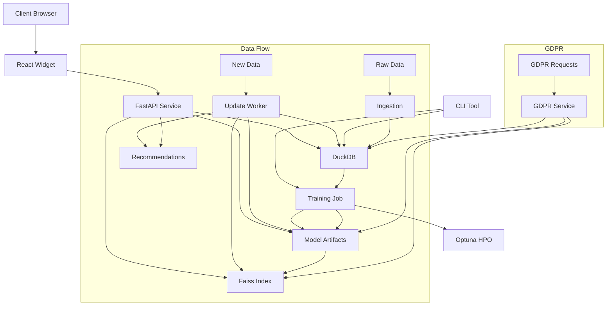

# RecSys-Lite Architecture

## System Overview

RecSys-Lite is a lightweight recommendation system designed for small e-commerce shops that need to run on CPU-only infrastructure and maintain data residency within the EU for GDPR compliance. The system provides multiple recommendation algorithms, automatic hyperparameter optimization, fast recommendation serving, and a React widget for displaying recommendations.



## Components

### Data Layer

- **DuckDB**: In-process analytical database that stores user-item interactions and item metadata
- **Data Format**: 
  - Events: Parquet files with `user_id`, `item_id`, `ts`, `qty`
  - Items: CSV files with `item_id`, `category`, `brand`, `price`, `img_url`
- **Schema**:
  ```sql
  CREATE TABLE events (
    user_id VARCHAR,
    item_id VARCHAR,
    ts BIGINT,
    qty INTEGER
  );
  
  CREATE TABLE items (
    item_id VARCHAR PRIMARY KEY,
    category VARCHAR,
    brand VARCHAR,
    price DOUBLE,
    img_url VARCHAR
  );
  ```

### Model Layer

- **ALS/BPR (implicit)**: Matrix factorization models for collaborative filtering
  - Optimized for implicit feedback (views, purchases)
  - Fast training on CPU
  - Supports incremental updates via `partial_fit_users`
  
- **item2vec (gensim)**: Embedding-based item similarity model
  - Treats items as words and sessions as sentences
  - Produces dense vector representations of items
  - Good for capturing semantic similarities

- **LightFM**: Hybrid matrix factorization supporting side features
  - Combines collaborative and content-based filtering
  - Can utilize item metadata (categories, brands)
  - Handles cold-start problem effectively

- **GRU4Rec (PyTorch)**: Optional sequential recommendation model
  - Session-based recommendations using RNNs
  - Captures temporal patterns in user behavior
  - CPU-optimized implementation

- **Optuna**: Hyperparameter optimization framework
  - Optimizes key parameters like factors, learning rate, regularization
  - Metrics: HR@10, HR@20, NDCG@10, NDCG@20
  - Employs efficient search algorithms (TPE)

### Serving Layer

- **Faiss**: Fast approximate nearest neighbor search for recommendations
  - IVF-Flat index for efficient similarity search
  - Optimized for CPU environment
  - Support for incremental updates

- **FastAPI**: RESTful API for serving recommendations
  - Endpoints:
    - `/recommend?user_id=&k=` - Get recommendations for a user
    - `/similar-items?item_id=&k=` - Get similar items
    - `/metrics` - Performance and operation metrics
    - `/health` - Health check
  - JSON responses with item metadata

- **Update Worker**: Micro-batch worker that updates models incrementally
  - Runs every 60 seconds
  - Fetches new events from DB or Parquet files
  - Updates user factors with `partial_fit_users`
  - Adds new item vectors to Faiss index

### Frontend Layer

- **React Widget**: Responsive recommendation carousel
  - Built with React 18
  - Customizable styling and behavior
  - Lazy loading of images
  - Responsive design for all screen sizes

- **shadcn/ui**: Accessible UI components
  - Clean, modern design
  - Accessibility support
  - Theming capabilities

## Performance Characteristics

- **Data Volume**: Optimized for up to 10M interactions (user-item events)
- **Item Catalog**: Handles up to 100K items efficiently
- **Response Time**: <100ms for recommendation requests (95th percentile)
- **Update Latency**: New events reflected in recommendations within 2 minutes
- **Training Time**: ~5 minutes for 1M interactions (8-core CPU)
- **Memory Footprint**: 2-4GB RAM for typical workloads

## Scaling Considerations

- **Horizontal Scaling**: Multiple API instances can share the same model artifacts
- **Vertical Scaling**: Performance improves with more CPU cores
- **Data Size Limits**:
  - DuckDB efficiently handles several GB of data
  - Faiss index size scales linearly with item count and vector dimensions
  - Model training time scales approximately linearly with data size

## Data Flow

1. **Ingestion**:
   - Events and items are loaded into DuckDB via the CLI (bulk) or the
     `stream-ingest` helper which watches a directory for new parquet files.
   - DuckDB provides efficient querying for model training
   - Supports batch, streaming, and incremental ingestion modes

2. **Training**:
   - Models are trained on the ingested data
   - Optuna optimizes hyperparameters
   - Models are saved to the model_artifacts directory
   - Faiss index is built from item vectors

3. **Serving**:
   - FastAPI loads model artifacts and the Faiss index
   - API endpoints provide recommendations based on user ID or item ID
   - React widget displays recommendations in the client browser
   - Performance metrics are tracked and exposed

4. **Updates**:
   - Update worker polls for new events every 60 seconds
   - Models are updated incrementally with new user interactions
   - Faiss index is updated with new item vectors
   - No retraining required for regular updates

5. **GDPR Compliance**:
   - User data can be exported via CLI
   - User data can be deleted with immediate effect
   - Deleted user data is removed from models during updates

## Deployment

The entire system is packaged in a Docker image (<1GB) for easy deployment:

- **Multi-stage Build**: Reduces image size
- **Distroless Container**: Minimizes attack surface
- **Docker Compose**: Simplifies deployment
- **Resource Requirements**: 8 CPU cores, 16GB RAM for optimal performance

## Security and Privacy

- **No External Dependencies**: No outbound network calls after deployment
- **Data Residency**: All data remains within the deployed environment
- **GDPR Compliance**: Built-in tools for data export and deletion
- **Isolation**: Containerized deployment for security
- **No PII**: Personal identifiable information is not stored in models or indices

## Monitoring and Maintenance

- **API Metrics**: Request count, latency, error rates
- **Model Metrics**: Recommendation quality, coverage
- **Health Checks**: API and worker status
- **Retraining**: Recommended weekly for optimal performance
- **Backup**: Artifacts can be easily backed up from the model_artifacts directory