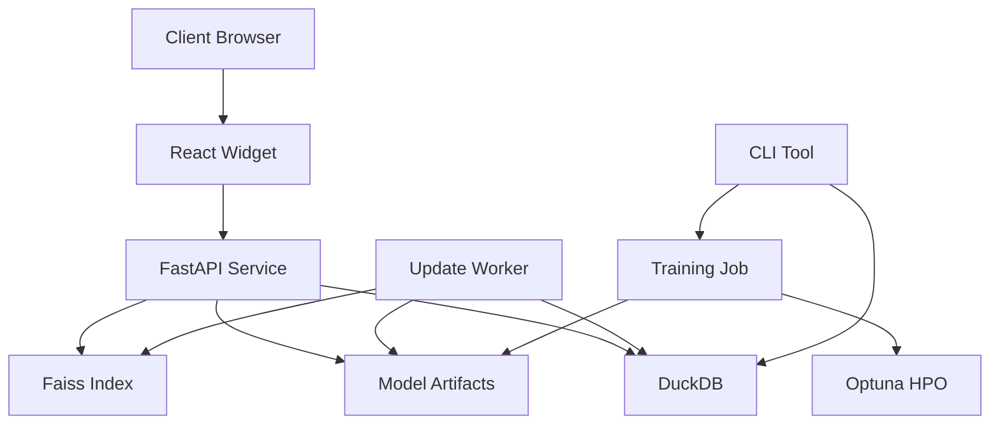

# RecSys-Lite Architecture

## System Overview

RecSys-Lite is a lightweight recommendation system designed for small e-commerce shops that need to run on CPU-only infrastructure and maintain data residency within the EU for GDPR compliance.

## Components

### Data Layer

- **DuckDB**: In-process analytical database that stores user-item interactions and item metadata
- **Data Format**: 
  - Events: Parquet files with `user_id`, `item_id`, `ts`, `qty`
  - Items: CSV files with `item_id`, `category`, `brand`, `price`, `img_url`

### Model Layer

- **ALS/BPR (implicit)**: Matrix factorization models for collaborative filtering
- **item2vec (gensim)**: Embedding-based item similarity model
- **LightFM**: Hybrid matrix factorization supporting side features
- **GRU4Rec (PyTorch)**: Optional sequential recommendation model
- **Optuna**: Hyperparameter optimization framework

### Serving Layer

- **Faiss**: Fast approximate nearest neighbor search for recommendations
- **FastAPI**: RESTful API for serving recommendations
- **Update Worker**: Micro-batch worker that updates models incrementally

### Frontend Layer

- **React Widget**: Responsive recommendation carousel
- **shadcn/ui**: Accessible UI components

## Data Flow

1. **Ingestion**:
   - Events and items are loaded into DuckDB via the CLI
   - DuckDB provides efficient querying for model training

2. **Training**:
   - Models are trained on the ingested data
   - Optuna optimizes hyperparameters
   - Models are saved to the model_artifacts directory

3. **Serving**:
   - FastAPI loads model artifacts and the Faiss index
   - API endpoints provide recommendations based on user ID
   - React widget displays recommendations in the client browser

4. **Updates**:
   - Update worker polls for new events
   - Models are updated incrementally
   - Faiss index is updated with new item vectors

## Deployment

The entire system is packaged in a Docker image (<1GB) for easy deployment on commodity hardware.